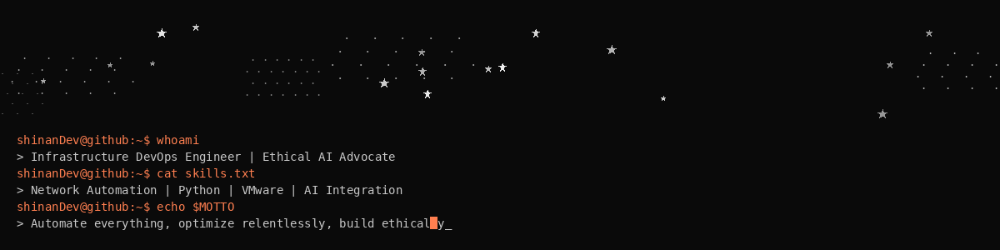

<div align="center">
  
</div>

<br/>

---

## About Me

```python
class Developer_AI_Engineer:
    def __init__(self):
        self.name = "Philipp"
        self.role = "Junior Developer | AI Engineer in training"
        self.location = "Hamburg, Germany"
        self.education = "Fachinformatiker Anwendungsentwicklung @ BBQ Hamburg"
        
        self.expertise = [
            "Network Automation",
            "Python Development", 
            "VMware & Storage",
            "AI Integration",
            "Ethical AI Principles",
            "Lifelong Learner"
        ]
        
        self.recent_work = {
            "Junior Developer (6m)": "FemAI - Ethical AI Solutions",
            "AI Trainer (1y)": "Outlier.ai",
            "System Engineer (3+y)": "Vater Business IT",
            "IT Helpdesk (3+y)": "3net GmbH"
        }
        self.current_education = {
            "Student": "BBQ Hamburg (Jun 2025 - Jun 2027)"
        }
        
        self.experience = "11+ years IT Infrastructure"
    
    def get_philosophy(self):
        return """
        ‣ Automate everything, optimize relentlessly
        ‣ Build ethical AI that respects humanity
        ‣ Learn continuously, share knowledge freely
        """

    def current_focus(self):
        return [
            "IHK Certification - Fachinformatiker fuer Anwendungsentwicklung",
            "Building Ethical AI applications",
            "Goal: AI Engineer role (2027)"
        ]
  
```

---

## Certifications

<div align="center">
<table>
<tr>
<td align="center" width="50%">

<a href="https://api.badgr.io/public/assertions/R1d0RrbGQT2Koi9HNcj8yw" target="_blank">
  
</a>

[Verify on Badgr](https://api.badgr.io/public/assertions/R1d0RrbGQT2Koi9HNcj8yw)

</td>
<td align="center" width="50%">

<a href="https://www.credly.com/badges/165fda95-ddb3-4947-95f1-aa629dfaf027/public_url" target="_blank">
  
</a>

[Verify on Credly](https://www.credly.com/badges/165fda95-ddb3-4947-95f1-aa629dfaf027/public_url)

</td>
</tr>
</table>

---

**Other Achievements:**
☁️ Google Cloud LLM Certification

</div>

## Tech Arsenal

<div align="center">

### Programming & Scripting


### Infrastructure & Networking


### AI & Development


### Frameworks & Libraries


### SQL Databases


### Cloud & Tools


</div>

---

## Philosophy & Values

### "Building Ethical AI, Automating the future"

*"The only truly secure system is one that's automated, monitored, and built with ethical principles at its core."*

**Core Values:**
```
- Ethical AI First - Technology must serve humanity
- Automation Excellence - Eliminate repetition, focus on innovation  
- Continuous Learning - Every day is an opportunity to grow
- 100% Commitment - Accept nothing less than excellence
- Knowledge Sharing - Lift others as you climb
```

---

<div align="center">

[](https://www.linkedin.com/in/philipp-prinzen-46a51a166/)
[](mailto:info@dsompa.org)
[](https://github.com/shinanDev)

</div>

---

<div align="center">

### *"Yesterday is history. Tomorrow is a mystery. Today is a gift.*
###  *And that's why it called the present."*


<!-- Animated Footer -->


</div>
